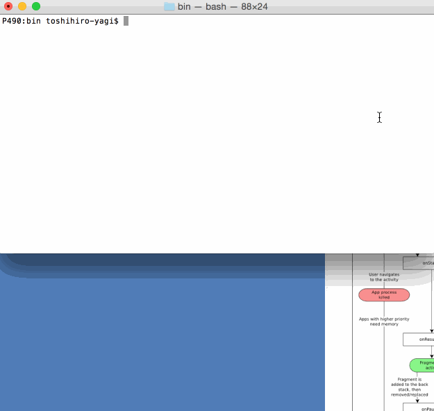

avd-peco
===============

Launch [android emulator](http://developer.android.com/tools/help/emulator.html) from console.



# Quick Start 

avd-peco require [peco](https://github.com/peco/peco) so install [peco](https://github.com/peco/peco) at first.

```
git clone https://github.com/sys1yagi/avd-peco.git
source avd-peco/bin/avd_peco.sh

avd_peco 
```

# Use Proxy

You can pass the argument.

```sh
avd_peco "-http-proxy http://192.168.1.1:8888"
```

# Lincense

```
Copyright 2014 Toshihiro Yagi

Licensed under the Apache License, Version 2.0 (the "License");
you may not use this file except in compliance with the License.
You may obtain a copy of the License at

   http://www.apache.org/licenses/LICENSE-2.0

Unless required by applicable law or agreed to in writing, software
distributed under the License is distributed on an "AS IS" BASIS,
WITHOUT WARRANTIES OR CONDITIONS OF ANY KIND, either express or implied.
See the License for the specific language governing permissions and
limitations under the License.
```
